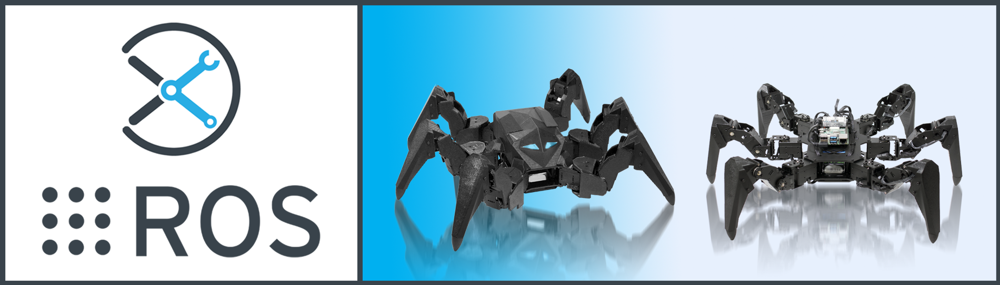
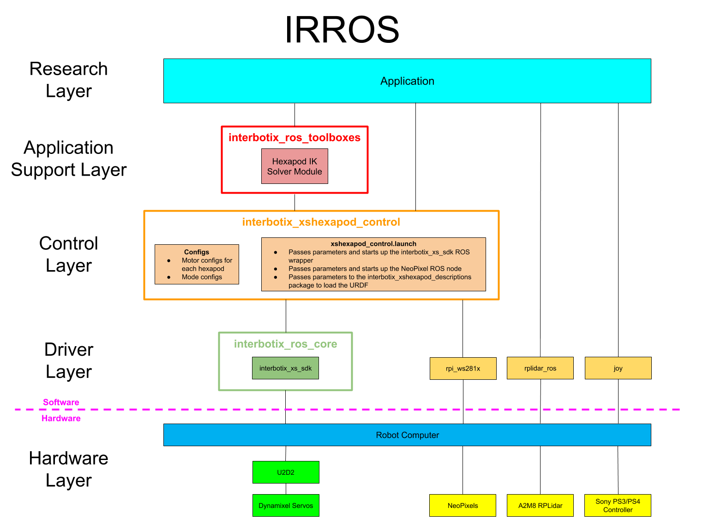

# Interbotix X-Series Hexapod ROS Packages

## Overview
Welcome to the *interbotix_ros_xshexapods* sub-repo! This sub-repository contains ROS packages meant to be used with the various X-Series hexapods sold by Trossen Robotics. Packages were tested on Ubuntu Linux 18.04 and 20.04 using ROS Melodic and Noetic respectively. Additionally, all ROS nodes were written using Python or C++. However, any programming language capable of sending ROS messages can be used to control the robots. To that effect, the core packages inside this repo are as follows:
- **interbotix_xshexapod_gazebo** - contains the config files necessary to launch a hexapod in Gazebo, including tuned PID gains for ros_control
- **interbotix_xshexapod_control** - contains the motor configuration files and the 'root' launch file that is responsible for launching the hexapod
- **interbotix_xshexapod_descriptions** - contains the meshes and URDFs (including accurate inertial models for the links) for all hexapod platforms

Finally, there is also an **examples** directory containing various demos of how the above mentioned core packages can be used. So what are you waiting for? Let's get started!

## IRROS Structure
Refer [here](https://github.com/Interbotix/interbotix_ros_core#code-structure) to get a general understanding of IRROS.

##### Hardware Layer
All hexapods contain six legs, each one made up of three [X-Series Dynamixel servos](https://www.trossenrobotics.com/dynamixel-x-series-robot-servos). Every servo has two 3-pin JST ports that allows it to be daisy chained with other servos using 3-pin cables. The 'root' Dynamixels (i.e. the 'coxa' servo on each leg) then connect to a larger version of the [XM/XL motor power hub](https://www.trossenrobotics.com/3-pin-x-series-power-hub.aspx) that has eight ports. Besides for providing 12V to the motors from the barrel jack, the hub also connects to the 3-pin JST port on the [U2D2](https://www.trossenrobotics.com/dynamixel-u2d2.aspx). This device acts as a communication interface between a computer (connected via microUSB cable) and the motors - converting USB/TTL signals back and forth.

On the right side of this layer, there are three sensors. The joystick controller can obviously be used to control the robot over Bluetooth. The other two sensors (i.e. the [RealSense camera](https://www.intelrealsense.com/) and the [A2M8 RPLidar](https://www.slamtec.com/en/Lidar/A2))- while not offered yet with our hexapod kits - would be great add-ons to do mapping or navigation projects.

##### Driver Layer
The ROS packages in this sub-repo build up from the *interbotix_xs_sdk* ROS wrapper found in the *interbotix_ros_core* repository. Reference the package there for implementation details. The *rplidar_ros* and *joy* packages are ROS wrappers around the RPLidar 360 degree laser scanner and PS3/PS4 controller devices respectively. Similarly, the *rpi_ws281x* Python module, while not a ROS package, is the driver used to control the NeoPixel LEDs on RPi4 controlled hexapods.

##### Control Layer
The *interbotix_xshexapod_control* ROS package found in this layer holds the config files for every one of our X-Series hexapods. These config files define the names of the joints that make up each hexapod as well as initial values for the motor registers. The launch file inside the package then passes the appropriate parameters to the *interbotix_xs_sdk* driver node depending on the type of hexapod being used.

##### Application Support Layer
The Hexapod IK Solver module shown in this layer can be found in the *interbotix_ros_toolboxes* repository [here](https://github.com/Interbotix/interbotix_ros_toolboxes/tree/main/interbotix_xs_toolbox). Specifically, it is located within the *interbotix_xs_modules* ROS package in a file called 'hexapod.py'. It essentially provides a small API to allow users to move a hexapod (either in place or in the world) in Python - no ROS experience necessary.

##### Research Layer
All the ROS packages and Python scripts found within the [examples](examples/) directory fall in this category.

## Compatible Products
The ROS packages located here can be used with any of the Interbotix Hexapod kits linked below. Next to each name is the name used to describe it in software (specifically for the `robot_model` argument in launch files). There are up to three parts in a name. The first two letters represent model type (ex. 'wx' for 'WidowX'). The name afterwards (i.e. 'mark4' in this case) corresponds to the specific type of hexapod family. Finally, the 's' after the name in some models stands for 'speed'. It just means the motors in that hexapod can move faster than the others.

- [PhantomX Hexapod MK-IV](https://www.trossenrobotics.com/phantomx-hexapod-mk4.aspx) (pxmark4)
- [PhantomX Hexapod MK-IVS](https://www.trossenrobotics.com/phantomx-hexapod-mk4-s.aspx) (pxmark4s)
- [WidowX Hexapod MK-IV](https://www.trossenrobotics.com/widowx-hexapod-mk4.aspx) (wxmark4)

## Requirements
Below is a list of the hardware you will need to get started:
- One of the X-Series Hexapod Kits mentioned above
- A Linux Computer with ROS (for remote networking)

## Hardware Setup
The hexapods in our kits ship fully assembled. Refer to the product pages above to learn about the hardware and how to properly maintain it. To power on the robot, just flick the switch on the back of the hexapod on. You should briefly see the LEDs on the motors flash red. Now give a minute or two for the computer to boot.

## Software Setup
To get all the code setup, refer to the computer platform types below (currently only one option, but this may change in the future) and run the appropriate installation script. Afterwards, continue with the [Installation Checks](#installation-checks) sub-section.

###### Raspberry Pi 4B (ARM64 Architecture)
If you purchased a RPi4-based ROS hexapod from our website, there is no need to install anything as the Pi should already come preloaded with all the necessary software. Instead, just skip to the [Remote Install](#remote-install) section. If you purchased your own Raspberry Pi 4B from a third party, feel free to follow the instructions [here](https://github.com/Interbotix/interbotix_ros_toolboxes/blob/main/interbotix_rpi_toolbox/README.md) to get it properly setup before following the commands below. If you only purchased the stand-alone Raspberry Pi 4B Kit from our store (which comes pre-configured with Ubuntu and ROS), and would like to use it with a hexapod, then follow the commands below to download and run the installation script. Note that the script will install the full desktop version of ROS Melodic/Noetic if it's not yet on your system, ask you for your desired robot model (ex. wxmark4), and prompt you about whether or not you'd like the Joystick ROS package to start at boot. Also note that the user-password is *interbotix*.

    $ sudo apt install curl
    $ curl 'https://raw.githubusercontent.com/Interbotix/interbotix_ros_crawlers/main/interbotix_ros_xshexapods/install/rpi4/xshexapod_rpi4_install.sh' > xshexapod_rpi4_install.sh
    $ chmod +x xshexapod_rpi4_install.sh
    $ ./xshexapod_rpi4_install.sh

If you *do* want to have the Joystick ROS package start at boot, you will first have to pair your PS4 controller with the Pi. Refer [here](https://github.com/Interbotix/interbotix_ros_toolboxes/tree/main/interbotix_rpi_toolbox#ps4-controller-setup) for details.

##### Remote Install
For some robotic projects, you may want to run your robot in a 'headless' state on some computer (like a NUC or Raspberry Pi), and monitor the robot's state (in Rviz for example) on your personal (a.k.a remote) computer over a local network. For this to work, run the installation script below on your personal Linux computer. Note that ROS and Rviz must already be installed! As an FYI, the script will prompt you to insert the hostname of the robot (NOT the remote) computer. As an example, if you wanted to monitor the state of a RPi4-based hexapod, you would set the hostname to `pibot`. To find out the hostname of the robot computer, just open a terminal and type `hostname`.

    $ sudo apt install curl
    $ curl 'https://raw.githubusercontent.com/Interbotix/interbotix_ros_crawlers/main/interbotix_ros_xshexapods/install/xshexapod_remote_install.sh' > xshexapod_remote_install.sh
    $ chmod +x xshexapod_remote_install.sh
    $ ./xshexapod_remote_install.sh

Be aware that the installation script will export the ROS_MASTER_URI environment variable in your personal computer's ~/.bashrc file to `http://<hostname>.local:11311`. Make sure to comment out this line when done monitoring or your personal computer will complain about not being able to find its ROS Master.

To SSH from your remote to the robot computer, first connect your personal Linux computer to the same network to which the hexapod is connected. Then open a terminal and SSH into the hexapod by typing (assuming a RPi4-based hexapod)...

    $ ssh -X pibot@pibot.local

You will be prompted for a password - just type *interbotix* and you should be in!

The *-X* flag in the command above allows window forwarding. This means that it's possible to open small graphical applications on the hexapod computer which will be forwarded to your personal computer. Let's open the terminal application by...

    $ mate-terminal &

Now, we can open up new terminals (via **Ctrl-Shift-T**) on the hexapod computer without having to SSH each time. Note that unless otherwise stated, all the following commands should be executed in the new terminal window that pops up

##### Installation Checks
After running the installation script on the robot computer, verify that it was successful in finding the U2D2 by checking that the port name shows up as `ttyDXL`

    $ cd /dev
    $ ls
    $ cd

For ROS Melodic users, open the following Gazebo config file to fix an issue described [here](https://answers.gazebosim.org//question/25030/gazebo-error-restcc205-error-in-rest-request/).

    $ nano ~/.ignition/fuel/config.yaml

Now change the url inside from `https://api.ignitionfuel.org` to `https://api.ignitionrobotics.org`.

## Quickstart
Get familiar with the physical crawler (let's say... the WidowX Mark IV!) by executing the following command in the terminal:

    $ roslaunch interbotix_xshexapod_control xshexapod_control.launch robot_model:=wxmark4

Now, in a terminal on *your remote computer* (not via SSH), type...

    $ roslaunch interbotix_xshexapod_descriptions remote_view.launch

Rviz should appear on your remote computer and display a virtual real-time representation of the robot!

By default, all the Dynamixel motors in the robot are torqued on so it will be very difficult to manually manipulate them. To torque off all the motors, execute the command below in another terminal (either via SSH or on your remote computer). Be aware though that this will cause the crawler to collapse if it's not already resting.

    $ rosservice call /wxmark4/torque_enable "{cmd_type: 'group', name: 'all', enable: false}"

The command above torques off every motor in the 'all' group. This is a special group that includes every Dynamixel motor. To only torque off the left-front leg's motors, change the name from 'all' to 'left_front'. Likewise, to only torque off the right-middle leg's motors, change the name from 'all' to 'right_middle'.

Now you should be able to freely manipulate the legs you've torqued off. Take note of how the Rviz model accurately mimics the real robot. To make the robot hold a certain pose, manually move its legs, then execute the following command:

    $ rosservice call /wxmark4/torque_enable "{cmd_type: 'group', name: 'all', enable: true}"

You can now let go and observe how the hexapod stays in place.

During operation, it is possible that a motor or two will go into an error state (noticeable since it causes the motor's LED to blink red once a second). This could happen if one of the hexapod's toes gets snagged in the ground while walking, leading to the motor overloading. To fix it, open a terminal and type the following command to reboot the motor and torque it on (assuming the right-front-coxa servo went into an error state)...

    $ rosservice call /wxmark4/reboot_motors "{cmd_type: 'single', name: 'right_front_coxa', enable: true}"

Shutdown all nodes by pressing **Ctrl-C** in the terminal where you started the launch file. To shutdown the hexapod computer, type `sudo poweroff` in the terminal.

That ends the quickstart tutorial. To get familiar with the architecture and launch file arguments, refer to the READMEs of the core packages. Start with the [interbotix_xshexapod_descriptions](interbotix_xshexapod_descriptions/) package, then the [interbotix_xshexapod_control](interbotix_xshexapod_control/) package. Next, look at the [interbotix_xshexapod_gazebo](interbotix_xshexapod_gazebo/) package. This is the most logical approach to take to gain a better understanding of how they relate to each other. Afterwards, feel free to check out the demo projects in the [examples](examples/) directory.

## Troubleshooting
Refer to the guide [here](https://github.com/Interbotix/interbotix_ros_core/blob/main/interbotix_ros_xseries/interbotix_xs_sdk/TROUBLESHOOTING.md#troubleshooting-a-dynamixel-based-robot) to try to solve your problem. If you still need help, feel free to contact us as trsupport@trossenrobotics.com or submit an Issue. We strongly recommend the latter option though so that other people who may be facing the same difficulty can benefit. This repository is actively maintained and any open Issues will be addressed as soon as possible.

## Contributing
To contribute your own custom X-Series hexapod in this repo, you will need to do the following steps:
- Create a motor config file similar to the YAML files found [here](interbotix_xshexapod_control/config/) (excluding the 'modes.yaml' file). To get familiar with the parameter names, checkout the [Motor Config Template](https://github.com/Interbotix/interbotix_ros_core/blob/main/interbotix_ros_xseries/interbotix_xs_sdk/config/motor_configs_template.yaml). Note that the name of this file is what defines your *robot_model* name, and should be used when naming other files like the URDF. At this time, only 18 joint hexapods can be integrated.
- Create a URDF similar in structure to the ones found [here](interbotix_xshexapod_descriptions/urdf/). Don't forget to put all necessary meshes in the [meshes](interbotix_xshexapod_descriptions/meshes/) directory! As an FYI, it is extremely important that you follow the naming convention for the links, joints, and frame poses as found in the other hexapod files. Otherwise, the IK solver will not work properly.
- Create a set of Gazeo/ROS position controllers similar to the ones found [here](interbotix_xshexapod_gazebo/config/position_controllers/).
- Make sure to follow the same naming convention, structure, and documentation procedures as found in the repo before making a PR.

## Contributors
- [Solomon Wiznitzer](https://github.com/swiz23) - **ROS Engineer**
- [Levi Todes](https://github.com/LeTo37) - **Mechatronics & CAD Engineer**
