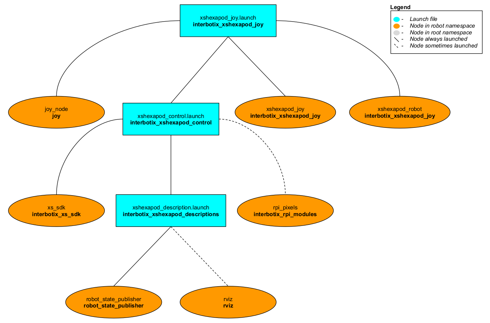

# interbotix_xshexapod_joy

## Overview
This package can be used to control any X-Series hexapod using a SONY PS3/PS4 controller via Bluetooth. As an FYI, all joints operate in 'position' control mode. Refer to the joystick button map below to see how to operate the robot. One feature of this package is that it allows you to make the hexapod walk in the world using one of three gaits (from fastest to slowest): tripod, ripple, and wave. It also allows you to translate and rotate the body of the hexapod in place. Finally, it allows you to cycle through the different legs and move them independently in Cartesian space. The IK and Gait Solvers were all custom made and can be found in the **xhexapod_robot** node.

## Structure

As shown above, the *interbotix_xshexapod_joy* package builds on top of the *interbotix_xshexapod_control* package. To get pointers about the nodes in that package, please look at its README. The other nodes are described below:
- **joy_node** - a ROS driver for a generic Linux joystick; it reads data from a joystick over Bluetooth and publishes  [sensor_msgs/Joy](http://docs.ros.org/melodic/api/sensor_msgs/html/msg/Joy.html) messages to the `commands/joy_raw` topic
- **xshexapod_joy** - responsible for reading in raw [sensor_msgs/Joy](http://docs.ros.org/melodic/api/sensor_msgs/html/msg/Joy.html) messages from the `commands/joy_raw` topic and converting them into [HexJoy](msg/HexJoy.msg) messages; this makes the code more readable and allows users to remap buttons very easily later.
- **xshexapod_robot** - responsible for reading in [HexJoy](msg/HexJoy.msg) messages and sending joint commands to the **xs_sdk** node; all joint commands are the result of IK outputs.

## Bluetooth Setup
#### Sony PS4 Controller (Recommended)
Getting a PS4 controller connected via Bluetooth to a Linux laptop is pretty straightforward. Click the *Bluetooth* icon on the top right of your screen, followed by *Bluetooth Settings...*. Next, press and hold the *Share* button on the PS4 controller (see image below for reference). While holding the *Share* button, press and hold the *PS* button. After a few seconds, the triangular shaped LED located between the *L2* and *R2* buttons should start rapidly flashing white (about twice a second) at which point you can let go.

On the computer, click the '+' icon in the *Bluetooth* settings window. Wait until you see 'Wireless Controller' pop up, select it, and click *Next* on the bottom right of the window. A message should display saying 'successfully set up new device 'Wireless Controller'' and the LED should turn blue. This means the controller is connected to the computer. To disconnect, hold down the *PS* button for about 10 seconds until the LED turns off. To reconnect, just press the *PS* button (no need to hold it down). After blinking white a few times, the LED should turn blue.


##### Sony PS3 Controller
Getting a PS3 controller connected via Bluetooth to a Linux laptop can be a bit finicky at times. However, the commands below should do the trick. Get an original SONY PS3 controller, it's accompanying USB cable, and open up a terminal. Type:
```
$ sudo bluetoothctl
[bluetooth]# power on
[bluetooth]# agent on
[bluetooth]# scan on
```
Now, plug the PS3 controller into the Linux Laptop. At this point, a message should pop up in the terminal that looks something like the following (with a different MAC address):
```
[NEW] Device FC:62:B9:3F:79:E7 PLAYSTATION(R)3 Controller
```
When it appears, type:
```
[bluetooth]# trust <MAC-address>
```
Now unplug the PS3 controller and press the PS button. The four red LEDs at the front of the controller should flash a few times, eventually leaving just one LED on by the '1'. This means that the joystick paired successfully.

Sometimes, the joystick might cause the cursor of the computer mouse to go crazy. To fix this, add the following line to the `~/.bashrc` file:
```
alias joy_stop='xinput set-prop "PLAYSTATION(R)3 Controller" "Device Enabled" 0'
```
Now, whenever the PS3 joystick is paired to the computer, just type `joy_stop` in the terminal to stop it messing with the mouse (you're welcome).

## Usage

Before starting the hexapod, either hold the body in the air or position the legs on the floor so that they won't slip while lifting the hexapod's body. Then, after pairing the joystick, type the following in a terminal (let's say to control the WidowX Mark IV):
```
roslaunch interbotix_xshexapod_joy xshexapod_joy.launch robot_model:=wxmark4
```
Two red or yellow messages might appear in the terminal mentioning how the root link has an inertia specified in the URDF or joystick force feedback couldn't be configured properly. This is normal and will not affect the joystick operation. To further customize the launch file at run-time, look at the table below. Note that it is recommended to narrow the hexapod stance by 2 or 3 cm, and to raise the hexapod body height a bit for optimal usage (see the joystick button mappings below to see how to do this).

| Argument | Description | Default Value |
| -------- | ----------- | :-----------: |
| robot_model | model type of the Interbotix Hexapod such as 'pxmark4' or 'wxmark4' | "" |
| robot_name | name of the robot (typically equal to `robot_model`, but could be anything) | "$(arg robot_model)" |
| use_rviz | launches Rviz | true |
| mode_configs | the file path to the 'mode config' YAML file | refer to [xshexapod_joy.launch](launch/xshexapod_joy.launch) |
| load_configs | a boolean that specifies whether or not the initial register values (under the 'motors' heading) in a Motor Config file should be written to the motors; as the values being written are stored in each motor's EEPROM (which means the values are retained even after a power cycle), this can be set to false after the first time using the robot. Setting to false also shortens the node startup time by a few seconds and preserves the life of the EEPROM | true |
| threshold | value from 0 to 1 defining joystick sensitivity; a larger number means the joystick should be less sensitive | 0.75 |
| controller | type of controller ('ps3' or 'ps4') | ps4 |
| x_stride | distance in meters that the hexapod should go forward/backward in a single gait cycle | 0.10 |
| y_stride | distance in meters that the hexapod should go side-to-side in a single gait cycle | 0.06 |
| yaw_stride | distance in radians that the hexapod should rotate in a single gait cycle | 0.3927 |
| x_pos_yaw_fudge | distance in radians that the hexapod should rotate in a single gait cycle while walking forward; use to account for drift | 0 |
| x_neg_yaw_fudge | distance in radians that the hexapod should rotate in a single gait cycle while walking backward; use to account for drift | 0 |
| y_pos_yaw_fudge | distance in radians that the hexapod should rotate in a single gait cycle while crab-walking left; use to account for drift | 0 |
| y_neg_yaw_fudge | distance in radians that the hexapod should rotate in a single gait cycle while crab-walking right; use to account for drift | 0 |
| p_gain | passthrough to the Position_P_Gain register in all of the motors; increasing it makes the motors better follow their goal positions | 800 |
| move_step_time | time [sec] that it should take for each motor to go from its current position to its goal position; this parameter is used in every iteration of the control loop when the hexapod is walking, moving in place, or moving its leg; note that as the control loop runs faster than than this, this parameter is really meant as a smoothing mechanism; the lower the value, the faster each motor responds, potentially leading to jerkier behavior; conversely, the higher the value, the smoother the behavior, but the slower each motor responds | 0.15 |
| num_steps | proportional to the number of IK iterations completed in a single gait cycle; number of actual steps is *num_steps* for the tripod gait, *num_steps* x 1.5 for the ripple gait, and *num_steps* x 3 for the wave gait; the lower the number, the coarser and faster the motion; inversely, the higher the number, the finer and slower the motion | 20 |
| max_foot_height | peak height in meters that every foot will reach during its swing phase; the higher the number, the easier it is for the hexapod to traverse coarse ground (like rugs) without tripping; making it too high though can cause joint limits to be reached or for no valid solutions to be found while doing IK | 0.04 |
| launch_driver | true if the *xsarm_control.launch* file should be launched - set to false if you would like to run your own version of this file separately | true |

To understand how the joystick buttons map to controlling the robot, look at the diagram and table below.


| Button | Action |
| ------ | ------ |
| START/OPTIONS | move hexapod to Home pose (default is that T_sb resets to x,y,roll, pitch, yaw = 0 and z = preset height. legs stay where they are)|
| SELECT/SHARE | move hexapod to its Sleep pose |
| R2 | rotate the hexapod clockwise |
| L2 | rotate the hexapod counterclockwise |
| Triangle | cycle up through the hexapod legs when in 'move_leg' mode  OR cycle up through the various gaits when in 'move_hexapod' mode |
| X | cycle down through the hexapod legs when in 'move_leg' mode OR cycle down through the various gaits when in 'move_hexapod' mode |
| O | widen stance when in 'move_hexapod' mode in 1cm increments|
| Square | narrow the stance when in 'move_hexapod' mode in 1cm increments OR reboot servos that are in error states in 'move_leg' mode|
| D-pad Up | increase the control loop rate in 1 Hz step increments (max of 40) |
| D-pad Down | decrease the control loop rate in 1 Hz step increments (min of 10) |
| D-pad Left | 'coarse' control - sets the control loop rate to a user-preset 'fast' rate |
| D-pad Right | 'fine' control - sets the control loop rate to a user-preset 'slow' rate |
| Left stick Up/Down | walk the hexapod forward/backward using the currently selected gait |
| Left stick Left/Right | walk the hexapod left/right using the currently selected gait |
| L3 | reset the Home Pose stance to whatever stance the robot is currently in (helpful if you want the 'z' component of the hexapod higher or a more narrow stance) |
| Right stick Up/Down | increase/decrease pitch of hexapod OR translate the hexapod body forward/backward |
| Right stick Left/Right | increase/decrease roll of the hexapod OR translate the hexapod body left/right |
| R3 | switch between the two Right stick control options |
| R1 | increase z of hexapod |
| L1 | decrease z of hexapod |
| PS | switch between 'move hexapod' and 'move_leg' modes |

Depending on what mode the hexapod is in, the LEDs in its eyes will flash different colors or blink a certain number of times. Refer to the tables below for details.

| Move Hexapod Mode | LED Color |
| ------ | ------ |
| Tripod Gait (3 legs at a time) | Both eyes turn light blue |
| Ripple Gait (2 legs at a time) | Both eyes turn magenta |
| Wave Gait (1 leg at a time) | Both eyes turn green |
| Increase/Decrease stance | Both eyes turn light brown |

| Move Leg Mode | LED Color |
| ------ | ------ |
| Left-front leg | Left eye blinks 1 time |
| Left-middle leg | Left eye blinks 2 times |
| Left-back leg | Left eye blinks 3 times |
| Right-front leg | Right eye blinks 1 time |
| Right-middle leg | Right eye blinks 2 times |
| Right-back leg | Right eye blinks 3 times |
| Reboot servos | Both eyes turn deep blue -> then back to the previous color at completion |

| Both Modes | LED Color |
| ------ | ------ |
| Home Pose | Both eyes turn yellow -> then back to the previous color at completion |
| Sleep Pose | Both eyes turn yellow -> then back to the previous color at completion |
| Increase control rate | Both eyes brighten |
| Decrease control rate | Both eyes dim |
| Preset 'course' rate | Both eyes brighten to the 'course' rate value |
| Preset 'fine' rate | Both eyes dim to the 'fine' rate value |
| Set new Home Pose Stance | Both eyes do a quick double blink |
| Switch to Move Hexapod mode | Both eyes light up with the color signifying the currently selected gait |
| Switch to Move Leg mode | Both eyes turn red |

## Troubleshooting

##### Hexapod stops midway through a gait cycle and goes to the Home pose
Depending on the stride lengths specified in the launch file, the active gait and current body pose, the hexapod may be unable to complete a walking gait cycle. If this happens, the hexapod will abort the attempt and just go back to the Home pose. Typically, raising or lowering the hexapod's body or increasing/decreasing it's stance may increase the likelihood of it being able to complete a gait cycle. If that does not work, try to decrease the *x_stride*, *y_stride*, or *yaw_stride* launch file arguments.

##### Hexapod is walking funny or slipping a lot
Sometimes, especially if the hexapod is in an awkward position or on a slippery surface, a motor or two will overload. This will cause it to blink red and essentially torque off - leading to the hexapod walking funny. To fix this, just press the reboot button on the controller and the blinking should stop. Then put the hexapod back in its Home Pose, and carry on!

If the hexapod continues to walk strangely, you may be low on battery (below 10V) - resulting in motors turning off. In this case, shutdown the hexapod and charge the battery.

##### Hexapod is not responding to the Joystick Controller
This tends to happen if the PS4 controller is left idle for a few minutes. To fix it, hold down the *PS* button until the Blue LED at the front shuts off. Then tap it again and wait for it to turn blue. At this point, it should work again.

Otherwise, the PS4 controller may be low on juice. So go ahead and charge it!
