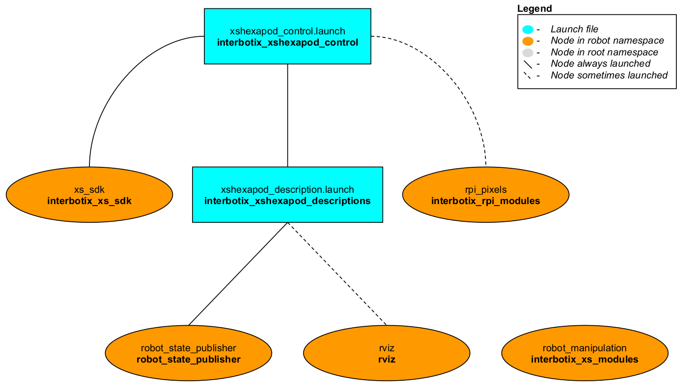
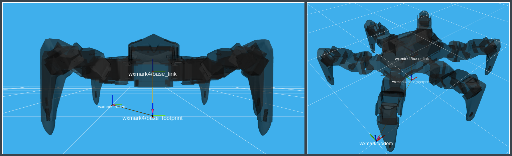
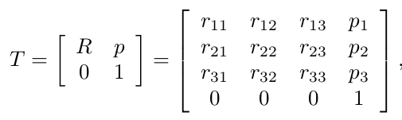

# Interbotix X-Series Hexapod Python API Demos

## Overview
This directory showcases various ways of using the [Interbotix Python Hexapod Module](https://github.com/Interbotix/interbotix_ros_toolboxes/blob/main/interbotix_xs_toolbox/interbotix_xs_modules/src/interbotix_xs_modules/hexapod.py) (click the link to see the fully documented code; also check out the [interbotix_xs_modules](https://github.com/Interbotix/interbotix_ros_toolboxes/tree/main/interbotix_xs_toolbox/interbotix_xs_modules/src/interbotix_xs_modules) package to get a better understanding on how this and other modules can be used). Simply put, this API was created so that users with little to no ROS (or controls) experience would still have the ability to control any Interbotix Hexapod supported by the *interbotix_xs_sdk*. Specifically, the API opens up the following features:
-  Move the hexapod in the world using either the tripod, ripple, or wave walking gaits (odom frame is located at `<robot_name>/odom`)
- Move the hexapod in place by either translating the body along or rotating the body around the x, y, or z axes (located at the `<robot_name>/base_link` frame)
- Move individual legs in Cartesian space (relative to the `<robot_name>/base_footprint` frame)
- Move the hexapod in a cluttered world using an adaptive tripod gait; current feedback [mA] from some motors is used to determine when each foot has made contact with the floor or an obstacle
- Customize the color, brightness, blink and pulse rates of the NeoPixel LEDs on RPi4 based hexapods for your use case

## Structure

The Python Hexapod module (located in the *interbotix_xs_modules* ROS package) builds on top of the *interbotix_xs_sdk* package. To get familiar with the other nodes in the graph above, look at the various packages READMEs.

- **robot_manipulation** - a ROS node (operating 'behind the scenes') that takes in commands entered via the Python API and publishes data to various ROS topics as necessary. It is not a classic ROS node in the sense that it can't be launched from a ROS launch file or run from the terminal using a `rosrun` command. Rather, the Python API module contains a Class that when instantiated, gives the node life. At the completion of a program, the object gets destroyed, killing the node.

## Terminology


Before getting started with the Python API, it is important to understand some terminology. First off, odometery is specified from the `/<robot_name>/odom` frame (a.k.a the 'Space' frame) to the `/<robot_name>/base_footprint` frame. In the code documentation, this transform is known as **T_sf** (i.e. the transform that specifies the *base_footprint* frame relative to the *Space* frame). Similarly, the body pose of the hexapod is specified from the `/<robot_name>/base_footprint` frame to the `/<robot_name/base_link` frame (a.k.a the 'Body' frame). In the code documentation, this transform is known as **T_fb** (i.e. the transform that specifies the *base_link* frame relative to the *base_footprint* frame). It goes without saying that the 'red' axis is the 'X-frame', the 'green' axis is the 'Y-frame', and the 'blue' axis is the 'Z-frame'. The way this information is stored is using a transformation matrix as shown below.

<p align="center">
  
</p>

In the image above, the first three rows and three columns define a 3-dimensional rotation matrix that describes the orientation of the second frame with respect to the first frame. On the other hand, the first three rows and the fourth column of the matrix represent the translational position (i.e. xyz) of the second frame with respect to the first frame. Finally, the fourth row of the matrix is always [0 0 0 1] for matrix multiplication purposes.

It should be noted that all odometry is theoretically calculated (based on the commanded joint positions). For more accurate odometry, other sensors (like a lidar or depth camera) should be integrated.

On a different note, the best way to operate the hexapod can be found in the [usage.py](usage.py) Python script.

## Usage
To get started, open up a terminal and type (assuming a WidowX Mark IV is being launched)...
```
roslaunch interbotix_xshexapod_control xshexapod_control.launch robot_model:=wxmark4
```
In another terminal, navigate to this directory and type...
```
python move_in_place.py
```
You should observe the robot move its body along and around the X, Y, and Z axes of the `/<robot_name>/base_link` frame.

The other scripts work in a similar fashion, but you must make sure to change the robot name in the file to the hexapod you have. To make things easier, each script also outlines the commands necessary to get the robot moving!
