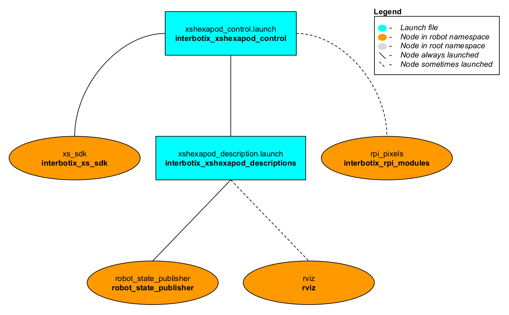

# interbotix_xshexapod_control

## Overview
This package contains the configuration and launch files necessary to easily start the Interbotix Hexapod platform. This includes launching the **xs_sdk** node responsible for driving the Dynamixel motors on the robot and loading the URDF to the `robot_description` parameter. Essentially, this package is what all 'downstream' ROS packages should reference to get the robot up and running.

## Structure


As shown in the image above, the *interbotix_xshexapod_control* package builds on top of the [interbotix_xshexapod_descriptions](../interbotix_xshexapod_descriptions) and [interbotix_xs_sdk](https://github.com/Interbotix/interbotix_ros_core/tree/main/interbotix_ros_xseries/interbotix_xs_sdk) packages. Please take a look at those packages to get familiar with their nodes. The other node is described below:
- **rpi_pixels** - a ROS wrapper that allows control of any number of NeoPixel LEDs; this includes color, blink rate, brightness, and pulse abilities; it subscribes to the custom PixelCommands ROS message on the `/<robot_name>/commands/pixels` topic. See more [here](https://github.com/Interbotix/interbotix_ros_toolboxes/tree/main/interbotix_rpi_toolbox/interbotix_rpi_modules).

You will also notice a [config](config/) directory containing many YAML files. Each file (beside the modes.yaml one) specifies the names and initial register values for all the motors that make up a specific hexapod. There is also some 'meta-info' like names of joint groups, the desired joint-topic name and publishing frequency, etc... For a full explanation of each of these parameters, check out the Motor Config file [template](https://github.com/Interbotix/interbotix_ros_core/blob/main/interbotix_ros_xseries/interbotix_xs_sdk/config/motor_configs_template.yaml). The other file located in that directory is the Mode Config one (a.k.a mode.yaml). The parameters in there define the desired operating modes for either a group of joints or single joints, and whether or not they should be torqued on/off at node startup. See more by referencing the Mode Config file [template](https://github.com/Interbotix/interbotix_ros_core/blob/main/interbotix_ros_xseries/interbotix_xs_sdk/config/mode_configs_template.yaml). Typically, the Motor Config file is only defined here while the Mode Config file is also defined in any 'downstream' ROS package. This makes it easy for users to configure their desired motor operating modes depending on their project.

## Usage
To run this package on the physical robot, type the line below in a terminal (assuming the PhantomX Mark IVS is being used).
```
roslaunch interbotix_xshexapod_control xshexapod_control.launch robot_model:=pxmark4s
```

To further customize the launch file at run-time, refer to the table below.

| Argument | Description | Default Value |
| -------- | ----------- | :-----------: |
| robot_model | model type of the Interbotix Hexapod such as 'pxmark4' or 'wxmark4' | "" |
| robot_name | name of the robot (typically equal to `robot_model`, but could be anything) | "$(arg robot_model)" |
| external_urdf_loc | the file path to the custom urdf.xacro file that you would like to include in the Interbotix robot's urdf.xacro file| "" |
| use_rviz | launches Rviz | false |
| rviz_frame | fixed frame in Rviz; this should be changed to `map` or `<robot_name>/odom` if mapping or using local odometry respectively | $(arg robot_name)/base_bottom_link |
| motor_configs | the file path to the 'motor config' YAML file | refer to [xshexapod_control.launch](launch/xshexapod_control.launch) |
| mode_configs | the file path to the 'mode config' YAML file | refer to [xshexapod_control.launch](launch/xshexapod_control.launch) |
| load_configs | a boolean that specifies whether or not the initial register values (under the 'motors' heading) in a Motor Config file should be written to the motors; as the values being written are stored in each motor's EEPROM (which means the values are retained even after a power cycle), this can be set to false after the first time using the robot. Setting to false also shortens the node startup time by a few seconds and preserves the life of the EEPROM | true |
| use_pixels | launch the ROS Wrapper node that drives the NeoPixel LEDs | false |
| use_sim | if true, the Dynamixel simulator node is run; use Rviz to visualize the robot's motion; if false, the real Dynamixel driver node is run | false |
